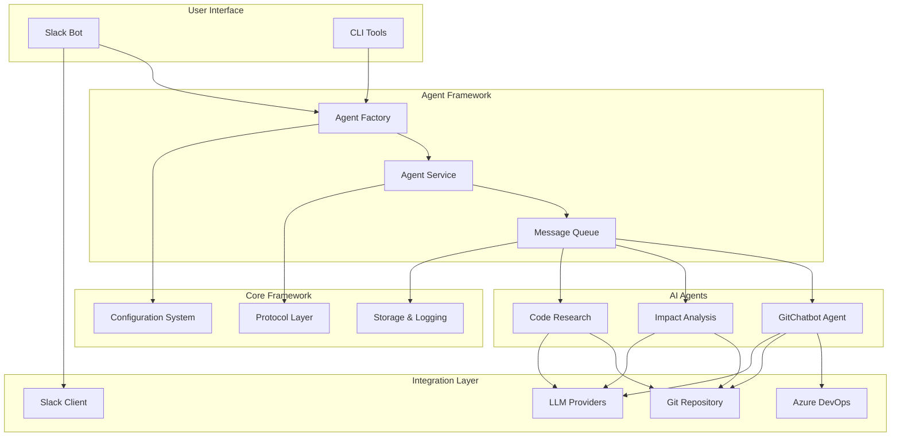

# Dev Agents Documentation

**AI-Powered Development Team Automation with PydanticAI**

[](https://github.com/codeligence/dev-agents/actions)
[](https://codecov.io/gh/codeligence/dev-agents)
[](https://pypi.org/project/dev-agents/)
[](https://github.com/codeligence/dev-agents/blob/main/LICENSE.md)
[](https://www.python.org/downloads/)

---

## Welcome to Dev Agents

Dev Agents is an enterprise-grade Python framework that revolutionizes development workflows by using AI agents to analyze code changes, generate testing insights, and provide intelligent assistance through Slack integration.

Built on the powerful [PydanticAI](https://docs.pydantic.ai/) framework, Dev Agents provides a protocol-based, type-safe architecture for creating sophisticated AI-powered development tools.

## Key Features

### 🤖 **AI-Powered Development Assistance**
- **Impact Analysis**: Intelligent assessment of code changes and their potential effects
- **Code Research Agent**: AI-driven exploration and analysis of your codebase
- **Git Integration**: Automatic repository monitoring and change detection
- **Test Generation**: AI-powered testing notes and recommendations

### 🏗️ **Enterprise Architecture**
- **Protocol-Based Design**: Type-safe, extensible architecture using Python Protocols
- **Clean Architecture**: Clear separation between framework, agents, and integrations
- **SOLID Principles**: Maintainable, testable, and scalable codebase
- **Full Type Safety**: mypy-compliant with comprehensive typing

### 🔌 **Seamless Integrations**
- **Slack Bot**: Real-time message processing with dual-thread architecture
- **Azure DevOps**: Work item tracking and pull request analysis
- **Git Repository**: Intelligent git operations and change tracking
- **Multi-LLM Support**: OpenAI GPT-4, Gemini, and extensible model support

## Quick Start

Get up and running with Dev Agents in minutes:

```bash
# Install Dev Agents
pip install dev-agents[all]

# Configure your environment
cp .env.example .env
# Edit .env with your API keys and configuration

# Run the Slack bot
dev-agents-slack-bot
```

!!! tip "New to Dev Agents?"
    Start with our [Installation Guide](installation.md) and [Quick Start](quick-start.md) to get your first agent running in under 10 minutes.

## Architecture Overview



## What Makes Dev Agents Different?

### **Protocol-Based Architecture**
Unlike traditional frameworks, Dev Agents uses Python Protocols to define type-safe interfaces, making it easy to extend and test while maintaining enterprise-grade reliability.

### **PydanticAI Integration** 
Built on PydanticAI, the framework provides structured outputs, automatic validation, and seamless integration with modern LLM providers.

### **Real-World Focus**
Designed for actual development workflows, not toy examples. Handle complex codebases, integrate with existing tools, and scale to enterprise environments.

## Use Cases

=== "Code Review Assistance"
    ```
    @dev-agents analyze the impact of PR #123
    ```
    Get AI-powered analysis of code changes, potential breaking changes, and testing recommendations.

=== "Codebase Exploration"
    ```
    @dev-agents help me understand the authentication flow
    ```
    Navigate complex codebases with AI assistance, understanding patterns and dependencies.

=== "Testing Guidance"
    ```
    @dev-agents what tests should I write for the new user service?
    ```
    Receive intelligent testing recommendations based on your code changes and patterns.

=== "Development Planning"
    ```
    @dev-agents analyze the impact of refactoring the payment system
    ```
    Understand the scope and implications of major code changes before starting work.

## Community & Support

- **📚 Documentation**: Comprehensive guides and API reference
- **🐛 Issues**: [GitHub Issues](https://github.com/codeligence/dev-agents/issues)
- **💬 Discussions**: [GitHub Discussions](https://github.com/codeligence/dev-agents/discussions)
- **🔒 Security**: [Security Policy](https://github.com/codeligence/dev-agents/security/policy)

## License & Compliance

Dev Agents is licensed under the [GNU Affero General Public License v3.0](https://github.com/codeligence/dev-agents/blob/main/LICENSE.md), ensuring the project remains open source while enabling commercial use.

- **GDPR Compliant**: Privacy-by-design architecture
- **SOC2 Patterns**: Enterprise-grade security practices
- **Audit Trail**: Comprehensive logging and activity tracking

---

## Next Steps

<div class="grid cards" markdown>

-   :material-clock-fast:{ .lg .middle } **Quick Start**

    ---

    Get your first Dev Agent running in minutes

    [:octicons-arrow-right-24: Quick Start Guide](quick-start.md)

-   :material-cog:{ .lg .middle } **Configuration**

    ---

    Configure Slack, Azure DevOps, and AI models

    [:octicons-arrow-right-24: Configuration Guide](configuration/)

-   :material-code-tags:{ .lg .middle } **Developer Guide**

    ---

    Build custom agents and extend the framework

    [:octicons-arrow-right-24: Developer Documentation](developer/)

-   :material-school:{ .lg .middle } **Examples**

    ---

    Working examples and integration patterns

    [:octicons-arrow-right-24: Code Examples](examples/)

</div>

---

*Built with ❤️ using [PydanticAI](https://docs.pydantic.ai/)*
